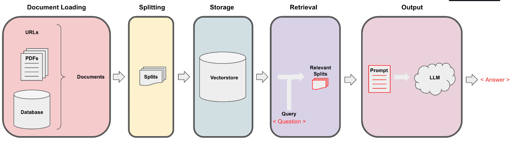

# Instalar o Python 3.12.3 e Criar environment:

Todo o projeto e comandos foram executados em um Linux

Criar environment:
```python3 -m venv .rag```

Ativar environment:
```source .rag/bin/activate```

Instalar os requirements do projeto:
```pip install -r requirements.txt```

Em caso de problemas com o requirements.txt:
```pip install python-dotenv tiktoken chromadb google-generativeai requests langchain langchain-community pymupdf```

Atualizar lista de requirements se baixar mais libs:
```pip freeze > requirements.txt```

*Note que o PDF possui camada de texto. É um PDF-A nato digital. Use txt ou PDF-A*

Fiz alguns comentários enxutos que podem ajudar a entender o funcionamento de cada código. Mas o princípio é esse:




Eu sempre instalo o Ollama no Linux, por conveniência e por ser o mais estável, mas já testei ele no Windows e funcionou. No docker ainda não testei.

Para instalar o Ollama:

https://github.com/ollama/ollama

Recomendação: tenha uma GPU, porque se não tiver vai ser lento, se não tiver garanta mais de 16GB RAM para sua CPU. Instale o CUDA e outros pacotes, eu recomendaria fazer tudo no WSL2 ou conectar o vscode em um servidor Ubuntu que tenha GPU.

CLI do Ollama:

Derrubar modelo:
```curl http://ip:11434/api/generate -d '{"model": "gemma2:latest", "keep_alive": 0}'```

Rodar modelo:
```curl http://ip:11434/api/generate -d '{"model": "gemma2:latest", "keep_alive": -1}'```

Para API do Gemini:

Eu estou usando o Gemini 1.5 Flash, que é gratuito com limitações de requisição. Só gerar a chave no site do google e se divertir.

https://ai.google.dev/gemini-api/docs/api-key?hl=pt-br

Na pasta test tenho um arquivo main.py que estava testando manter o database carregado e fazer varias perguntas durante a execução pelo terminal, ele funciona, só não esta otimizado 100%.
